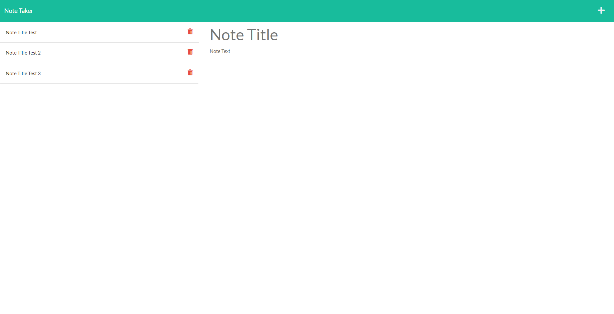

# Note Taker

## Description
I wanted to create a place where I was able to write and save notes. Using this site you will be able to organize thoughts as well as keep track of tasks you'd like to complete.
With this project I was able better develop my skills in writing routes.

## Usage
With this site you are able to input notes within the fields containing the example text "Note Title" and "Note Text". 
You can save your notes by clicking on the icon of a floppy disk on the top right. They will then be displayed to the left of your page.
If you wish to remove notes, you can delete them by clicking on the red trash bin next to your recently saved notes.
The screenshots below can be used as reference.

Image A) shows the area to input notes.
Image B) will display a list of saved notes.
Image C) is an example of removed notes.

### A)

### B)

### C)
